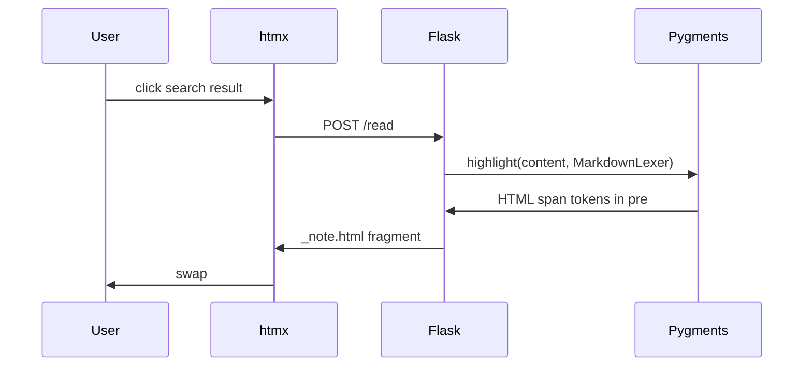

# Web UI Markdown Syntax Highlighting

**Date:** 2026-05-29  
**Status:** Approved

## Summary

Add server-side syntax highlighting for `.md` files in the ragamuffin web UI document panel. Users see colored markdown **source** (not rendered HTML). `.txt` and `.rst` files remain plain pre-wrapped text.

## Requirements

| Requirement | Decision |
|-------------|------------|
| Display mode | Syntax-highlighted source (editor-style), not rendered markdown |
| Grammar | Standard markdown only (Pygments `MarkdownLexer`) |
| File types | `.md` only; `.txt` / `.rst` unchanged |
| Line numbers | No |
| Obsidian extensions | Out of scope (`[[wiki-links]]`, callouts, tags stay unstyled) |

## Approach

**Server-side Pygments** (user choice over client-side Highlight.js).

- Highlight in Flask `/read` before rendering the htmx fragment
- No new JavaScript; htmx swap delivers already-highlighted HTML
- Add `pygments` as a direct dependency in `pyproject.toml` (already present transitively via `rich`, but must not rely on that)

## Architecture



## Files to Change

| File | Responsibility |
|------|----------------|
| `pyproject.toml` | Add `pygments` direct dependency |
| `web_app.py` | `highlight_markdown()` helper; call in `/read` for `.md`; context processor for Pygments CSS |
| `index.html` | Include injected Pygments CSS; layout styles for `.note-content--md` |
| `_note.html` | Branch on highlighted vs plain content |

## Implementation Details

### `highlight_markdown()` (in `web_app.py`)

```python
from pygments import highlight
from pygments.lexers import MarkdownLexer
from pygments.formatters import HtmlFormatter

_formatter = HtmlFormatter(style="friendly", nowrap=True, cssclass="highlight-md")

def highlight_markdown(content: str) -> str:
    return highlight(content, MarkdownLexer(), _formatter)
```

- **`friendly` style** — light theme compatible with the existing `#fafafa` UI
- **`nowrap=True`** — no line-number wrapper (line numbers not wanted)
- **`cssclass="highlight-md"`** — scoped class for token styles

### `/read` route

- If `full_path.suffix.lower() == ".md"`: compute `highlighted = highlight_markdown(content)` and pass to template
- Otherwise: pass `content` unchanged (current behavior)

### Pygments CSS injection

Register a Flask context processor in `create_app()` that exposes `pygments_css` — the output of `_formatter.get_style_defs(".highlight-md")`. `index.html` renders it inside a `<style>` block so token colors are available on initial page load and after every htmx fragment swap.

### `_note.html`

```html

<div class="note-content note-content--md">{{ highlighted | safe }}</div>

<div class="note-content">{{ content }}</div>

```

Use `| safe` only for Pygments output (HTML is generated server-side from trusted local files). Plain `content` stays auto-escaped by Jinja.

### `index.html` CSS

Add styles for the highlighted variant:

- `.note-content--md pre` — `overflow-x: auto`, monospace font family
- Match existing typography: `font-size: 0.9375rem`, `line-height: 1.7`
- Do **not** apply `white-space: pre-wrap` on `.note-content--md` (Pygments `<pre>` handles layout)

## Error Handling

If Pygments raises on a `.md` file, fall back to plain pre-wrapped text (same rendering as non-markdown files). The user still sees the document; no error message required.

## Testing

Manual verification:

1. `muffin --directory <vault> web` → search → open a `.md` file → headings, fences, emphasis show distinct token colors
2. Open a `.txt` or `.rst` file → plain pre-wrapped text, no highlighting
3. `.md` file containing `<script>` or `&` → characters display correctly (Pygments escapes HTML entities in output)

## Out of Scope

- Rendered markdown (HTML output)
- Obsidian-specific syntax highlighting
- Line numbers
- Syntax highlighting for `.txt` or `.rst`
- Client-side highlighters (Highlight.js, Prism, CodeMirror)
- Dark theme toggle

## Version Bump

Bump patch version in `pyproject.toml` after implementation (per project convention).
